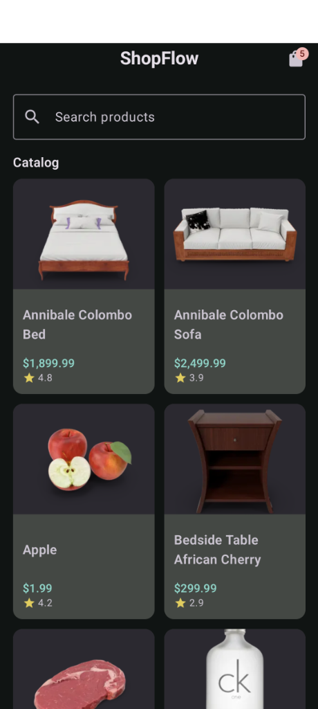
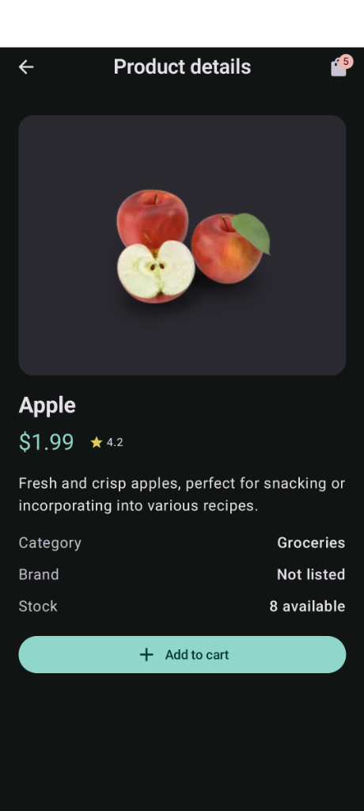
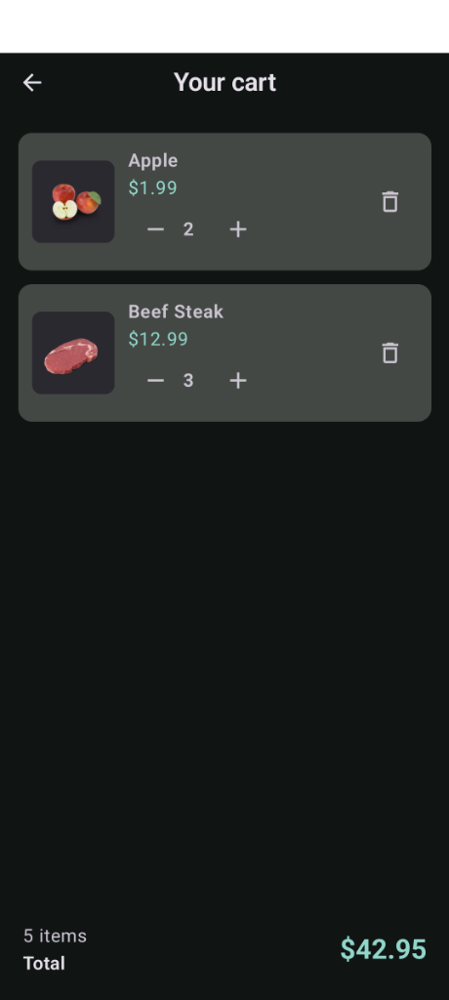

# ShopFlow

ShopFlow is a modern Android e-commerce application built with Jetpack Compose, Kotlin Coroutines & Flow, Retrofit, and Room. It integrates with the [DummyJSON Products API](https://dummyjson.com/docs/products) to display an interactive product catalog with search, detailed product views, and a reactive local shopping cart.

---

## Table of Contents
1. [Screenshots](#screenshots)
2. [Offline Cart](#offline-cart)
3. [Setup & Build Instructions](#setup--build-instructions)
4. [Architecture](#architecture)
5. [Libraries Used](#libraries-used)
6. [Local Storage Approach](#local-storage-approach)
7. [Important Design Decisions](#important-design-decisions)
8. [Production Scope](#production-scope)

---

## Screenshots

| Product Catalog | Product Details | Cart |
|---|---|---|
|  |  |  |

---

## Offline Cart

The cart is persisted locally using Room and remains fully functional
when the device is offline.

---

## Setup & Build Instructions

### Prerequisites
- **Android Studio**: Android Studio Ladybug / Meerkat (or newer recommended)
- **JDK**: Java 17+ / Java 21+ (configured via Gradle toolchain / Android Studio JBR)
- **Android SDK**:
  - `compileSdk`: **37**
  - `targetSdk`: **37**
  - `minSdk`: **24** (Android 7.0 Nougat and above)

### Cloning & Opening the Project
1. Clone the repository:
   ```bash
   git clone <repository-url>
   cd shopFlow
   ```
2. Open **Android Studio** and select **Open**, then choose the `shopFlow` directory.
3. Allow Gradle to synchronize dependencies.

### Building via Command Line
To assemble the debug APK:
```bash
./gradlew assembleDebug
```
The APK will be generated under:
```
app/build/outputs/apk/debug/app-debug.apk
```

To run unit tests or lint checks:
```bash
./gradlew testDebugUnitTest
./gradlew lintDebug
```

### Running on Device / Emulator
1. Connect a physical Android device with USB debugging enabled or launch an Android Virtual Device (AVD).
2. Run the application from Android Studio by clicking **Run 'app'** (`Shift + F10`) or via the CLI:
   ```bash
   ./gradlew installDebug
   ```

---

## Architecture

ShopFlow adheres to official **Android Architecture Guidelines**, implementing a clean, reactive, single-activity **MVVM (Model-View-ViewModel)** pattern with Unidirectional Data Flow (UDF) and an **Offline-First Single Source of Truth (SSOT)**:

```
┌────────────────────────────────────────────────────────┐
│                   UI Layer (Compose)                   │
│   CatalogScreen  │  ProductDetailScreen  │  CartScreen │
│                  ▲                       ▲             │
│            StateFlow (UIState)      User Events        │
│                  ▼                       │             │
├────────────────────────────────────────────────────────┤
│                      ViewModel                         │
│                    ShopViewModel                       │
│    • Combines DB flows with in-memory search query     │
│    • Exposes catalogUiState & cartUiState              │
│    • Dispatches user actions to repository             │
├────────────────────────────────────────────────────────┤
│                     Data Layer                         │
│                  ProductRepository                     │
│                  ▲                 ▲                   │
│     (Remote Sync)│                 │(Reactive Flow)    │
│                  ▼                 ▼                   │
│          DummyJsonApi (Retrofit)   Room Database       │
│                                    ├─ ProductDao       │
│                                    └─ CartDao          │
└────────────────────────────────────────────────────────┘
```

- **UI Layer (Jetpack Compose & Navigation 3)**:
  - Declarative UI components observing immutable state (`CatalogUiState`, `CartUiState`) via `collectAsStateWithLifecycle()`.
  - Type-safe navigation powered by AndroidX `navigation3` with a backstack of sealed route representations (`CatalogRoute`, `ProductRoute`, `CartRoute`).
- **ViewModel Layer (`ShopViewModel`)**:
  - Manages UI state using Kotlin Coroutines `StateFlow` with `SharingStarted.WhileSubscribed(5_000)` to survive configuration changes and conserve resources when UI is inactive.
  - Combines repository flows with user search queries to provide fast, responsive filtering.
- **Data Layer (`ProductRepository`)**:
  - Acts as mediator between the network API and the local database.
  - Employs an offline-first caching policy: queries always stream from the Room database, while network updates refresh the local database cache.

---

## Libraries Used

| Library | Version / Component | Purpose |
| :--- | :--- | :--- |
| **Jetpack Compose** | Compose BOM (`2026.09.00`) | Declarative, reactive UI toolkit for Android. |
| **Material 3** | `androidx.compose.material3` | Modern Material You design components, typography, and styling. |
| **AndroidX Navigation 3** | `1.2.0` (`runtime` & `ui`) | Next-generation declarative navigation for Compose applications. |
| **Lifecycle & ViewModel** | `2.11.0` | Lifecycle-aware coroutine scopes and state observation in Compose. |
| **Room** | `2.8.5` | SQLite object mapping and persistence engine with KSP compiler. |
| **Retrofit 2** | `3.0.0` | Type-safe REST client for consuming DummyJSON API. |
| **Gson Converter** | `3.0.0` | Serialization/deserialization for HTTP JSON payloads. |
| **OkHttp** | `5.5.0` | HTTP engine with customized connect and read timeouts. |
| **Coil 3** | `3.6.3` (`coil-compose`, `coil-network-okhttp`) | High-performance asynchronous image loading with memory and disk caching. |

---

## Local Storage Approach

ShopFlow uses **Room Database** (`ShopFlowDatabase`, version 1) backed by SQLite for robust, relational local persistence.

### Entities
1. **`products` (`ProductEntity`)**:
   - Stores cached product details (`id`, `title`, `description`, `price`, `rating`, `category`, `brand`, `stock`, `thumbnail`).
   - Serves as the local cache for offline reading and instant startup.
2. **`cart_items` (`CartItemEntity`)**:
   - Stores the user's shopping cart (`productId`, `title`, `price`, `thumbnail`, `quantity`).
   - Persists user selections permanently across app restarts and device reboots.

### Reactive Queries & Cache Invalidation
- **Continuous Flow Observation**: Both `ProductDao.observeAll()` and `CartDao.observeAll()` return `Flow<List<T>>`, automatically emitting updated lists whenever table contents change.
- **Atomic Cache Synchronization**: `ProductDao.replaceAll(products)` is marked with `@Transaction`, clearing old records and inserting fresh API entities in a single atomic database transaction.
- **Upsertion & Quantity Management**: The cart supports atomic item increment, decrement, and deletion through indexed `productId` operations.

---

## Important Design Decisions

1. **Single Source of Truth (SSOT) via Room**:
   - The UI does not directly display raw network responses. Instead, API responses populate Room, and the UI exclusively observes Room database streams. This guarantees data consistency, eliminates race conditions, and ensures full offline functionality.
2. **Graceful Offline Degradation & Error Handling**:
   - If network requests fail (e.g., no internet connectivity, socket timeouts), the app catches the `IOException` and presents a friendly inline error banner while retaining previously cached products and full cart usability.
3. **Optimized Cart Calculations in State**:
   - Cart subtotal and item count calculations are computed dynamically within `CartUiState` as pure functional transformations (`items.sumOf { it.price * it.quantity }`), avoiding synchronization inconsistencies.
4. **Coil 3 Multi-Tier Caching**:
   - Custom `ImageLoader` configured in `ShopFlowApplication` with a 25% memory cache and a 100MB disk cache to ensure fast rendering of product thumbnails without redundant network overhead.
5. **Fluid Navigation Stack**:
   - Implemented using AndroidX Navigation 3 with an explicit, mutable state backstack, making back navigation deterministic and decoupled from platform-specific fragments.

---

## Production Scope

- **Incremental catalog loading**: The catalog now requests DummyJSON in 24-item pages using `limit` and `skip`, appending each page to Room while keeping cached pages available offline. For very large catalogs, migrate this behavior to Paging 3 with a Room `RemoteMediator`.
- **Cached-stock enforcement**: Cart additions and quantity increases are capped at the product stock recorded in the most recently synced catalog. The app cannot perform real-time stock reservation because DummyJSON does not expose a transactional inventory API.
- **Checkout / Payment Gateway**: Checkout and payment processing still require a merchant account, provider SDK, backend order service, and server-side payment verification. They cannot be implemented securely against DummyJSON alone.
- **Sync conflict resolution**: Products are a server-owned, read-only catalog cache, so there are no local product edits to conflict with refreshes. If products become editable or two-way synced, add server revisions, ETags, or timestamps and a defined merge policy.
